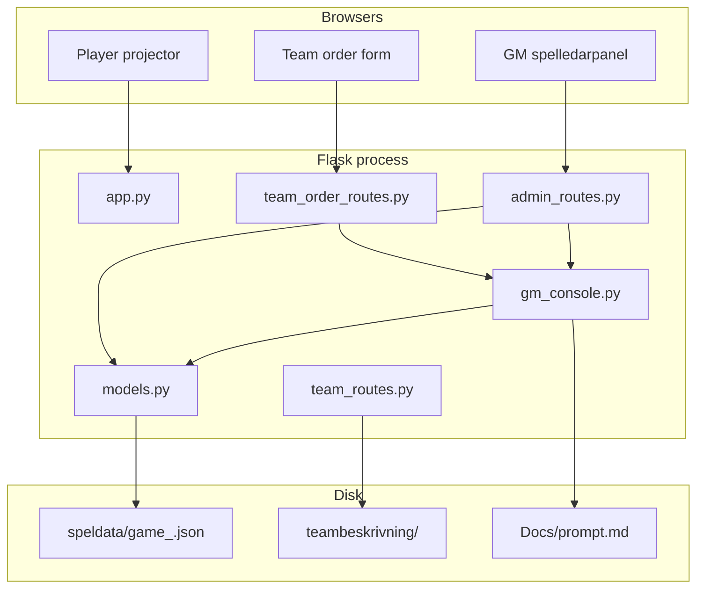

# Stabsspel — project architecture

This document describes **what the software is**, **how a live event runs through it**, **how the code is laid out**, and **what each folder and important file is for**.

It is a map of the repository, not the game rules. The exercise itself (teams, rounds, HP, spies, news studio) lives in [Stabsspel Traineeprogrammet.md](Stabsspel%20Traineeprogrammet.md). How orders are copied to an LLM, how the JSON is parsed, and how that affects HP, backlog, news and the room is in [LLM_WORKFLOW.md](LLM_WORKFLOW.md).

---

## For coding agents

Use these files for different kinds of truth:

| Need | Read |
|------|------|
| Game rules, teams, physical exercise, spy, paper news | `Docs/Stabsspel Traineeprogrammet.md` |
| LLM flow, HP queue, backlog, import/apply, projector secrecy | `Docs/LLM_WORKFLOW.md` |
| Code structure, routes, live domain and tests | this file |
| External LLM decision logic | `Docs/prompt.md` |
| Historical UX decisions | `Docs/UX_CONSOLE_REWORK.md` |

Do not treat leftover routes, unused HTML builders, root-level `test_*.py`,
or historical UX notes as the current specification.

If documentation and current domain code disagree, do not silently choose one.
Determine whether the difference is:
- an intentional current implementation,
- stale documentation, or
- a code defect.

Use the game rules and LLM contract to determine intended behaviour.
Report the discrepancy before changing game mechanics.

Legacy or unused code is never authoritative over current documentation and
the active domain implementation.

Preserve existing game mechanics unless the task explicitly changes them.
Make the smallest safe change and update only tests relevant to that change.
Do not clean up unrelated legacy code as part of a bug fix.

---

## 1. Purpose

Stabsspel is a **live staff-exercise (stabsspel) runner** for 20–60 people. A Game Master (GM) runs four quarters of a fictional year. Teams spend **handlingspoäng (HP)** on orders. After each round, orders are copied into an LLM together with app-generated dice rolls. The model returns JSON with news, HP, milestone suggestions, and GM-only resolution (`utfall`). Headlines are printed for the news studio. HP and backlog progress can be applied in the console after the GM confirms.

The app’s job is to **keep the room on the clock** and hold **orders, HP, backlog, and phase** as live state. It is not a news CMS, not a chat tool, and not a general admin CRUD product.

**In scope**

- Create / resume a game, password-protect the GM panel, delete a game (password in a modal)
- Run Order → Diplomacy → Result (four rounds), with timer, undo, and previous phase
- Collect team orders (draft → submit → optional withdraw in Orderfas)
- Show one GM console: compact header, tabs (Inkorg, LLM-resultat, Lag, Arbete, Historik)
- Project round, phase, time, public HP (and in Resultatfas this-round vs next-round HP) to the room
- Print activity cards, order cards, team briefs, QR links to order entry
- Freeze 1–100 rolls per submitted order, import LLM JSON (`utfall`, news, HP, milestones)

**Out of scope (intentional)**

- In-app headline editor / news CMS (studio still reads paper)
- Calling an LLM from the server (the GM copies text out and pastes JSON back)
- Player roster / spy seating as first-class state (spy drain is an HP transfer with a reason)
- Multi-server or database-backed persistence

---

## 2. How a live event uses the app

```
Home (/) lists saved games
Create / upload (/admin)
        │
        ▼
Spelledarpanel  ──────────────►  Spelarskärm  (/spelarskarm/<id>)
  GM console                       round, phase, clock, public HP
        │                          Resultatfas: denna runda → nästa runda
        ├── Orderfas     teams type orders via token URL / QR
        ├── Diplomatifas inbox + Kopiera till LLM (rolls freeze) + import JSON
        └── Resultatfas  studio reads paper news; GM sees utfall; apply HP/milestones
                │
                └── next round (or end after round 4)
```

News still happen **outside** the studio workflow: **Kopiera till LLM** opens `/admin/<id>/order_summary` (fill `Docs/prompt.md`, freeze rolls, copy) → paste JSON on that page → console tab **LLM-resultat** → copy headlines to paper → studio. The copy step freezes 1–100 rolls per submitted order (`llm_resolution`). The LLM must reuse those rolls when an outcome is actually uncertain; it must not invent dice. Unused rolls are valid: ordinary backlog work is deterministic progress and should not appear in `utfall`. Imported `utfall` is GM-only. Suggestions (`llm_forslag`) can apply HP/backlog on confirm. Projector payloads must not include `llm_forslag`, `llm_resolution`, rolls, probabilities, or order refs.

| Role | Where they look |
|------|-----------------|
| Game Master | `/` or `/admin` to pick a game, then `/admin/<spel_id>` — live console |
| Room / projector | `/spelarskarm/<spel_id>` — no orders, no GM buttons |
| Team | `/team/<spel_id>/<lag>` brief + QR, then `/team/<spel_id>/<token>/enter_order` |

---

## 3. Architecture

The process is a **single Flask app**. There is no database. Each game is one JSON file. HTML is mostly built in Python (f-strings / `render_template_string`), not a `templates/` tree.



**Layers**

| Layer | Modules | Responsibility |
|-------|---------|----------------|
| HTTP / process | `app.py`, `wsgi.py`, `config.py` | App entry, health, projector, home page |
| GM HTTP | `admin_routes.py`, `admin_helpers.py` | Auth, panel, live JSON mutations, print/export |
| Team HTTP | `team_routes.py`, `team_order_routes.py` | Briefs, QR, save/submit/withdraw orders |
| Live domain | `gm_console.py`, `gm_console_ui.py` | Phases, HP, inbox, backlog, undo, LLM rolls/`utfall`, public state, HTML |
| Persistence and catalogue | `models.py`, `game_management.py` | JSON load/save, teams, backlog templates, passwords |
| Print extras | `orderkort.py` | Printable order cards |

**Request flow (typical)**

1. GM opens `/admin/<id>`, enters password → Flask session (6 hours, sliding).
2. Panel HTML is `create_gm_console_html`: compact header (round/phase/timer, metadata, Spelarskärm) plus an action row (Nästa / Föregående / Ångra, timer, **Meny**).
3. Always-on tabs: **Inkorg**, **Lag**, **Arbete**, **Historik**. Diplomatifas and Resultatfas also get **LLM-resultat**. Default tab is Inkorg except Resultatfas (Lag), unless `?llm_view=` opens LLM-resultat.
4. `static/gm-console.js` polls `GET /admin/<id>/live` every 3s (inbox, HP, backlog, LLM apply state).
5. HP / backlog / inline order edits POST JSON; domain mutates the dict; `save_game_data` writes JSON under a per-game lock.
6. Projector polls `GET /spelarskarm/<id>/live` — **public** snapshot only (no inbox, log, testläge, rolls, or `utfall`).

---

## 4. Runtime and data

- **Python** 3.12 (`runtime.txt`), **Flask** 3.x, **Gunicorn** in production (`Procfile` → `wsgi:app`).
- **Persistence:** `speldata/game_<spel_id>.json` (gitignored). Atomic write: temp file → `os.replace`, plus `.backup`. Per-`spel_id` threading lock so two GM clicks do not clobber each other.
- **IDs:** `spel_id` is a readable timestamp plus a random suffix
  (`YYYYMMDDHHMMSS-<hex>`) so rapid creates/imports cannot overwrite each other.
- **No ORM.** The game dict *is* the model. `gm_console.py` is the place for live-event rules so they can be unit-tested without rendering HTML.

### Game JSON (important keys)

Created in `skapa_nytt_spel` and grown during play:

| Key | Meaning |
|-----|---------|
| `id`, `datum`, `plats`, `antal_spelare` | Event metadata |
| `lag` | Team names in this game (5 or 9) |
| `runda` | 1–4 |
| `fas` | `Orderfas` / `Diplomatifas` / `Resultatfas` |
| `avslutat` | Game over |
| `poang.<lag>` | `{ bas, aktuell, regeringsstod }` — spendable HP is `aktuell`, plus +10 if stöd |
| `hp_pending` | Queued HP deltas applied when a new round starts. LLM **Tillämpa HP** and GM ± after Orderfas change next round's wallet, not this round's remaining. |
| `backlog` | Dev-team work (Alfa / Bravo / STT). Bravo has phases (Krav, Design, …). `tidigare_hp` is the spent mark from the previous round for GM progress bars. |
| `team_orders.orders_round_N.<lag>` | `{ orders.activities[], final, submitted_at, updated_at, edited_by_gm, … }` |
| `team_tokens` | Secret URLs for order entry |
| `password` | PBKDF2 hash, or empty → default password for old games |
| `timer_*`, `orderfas_min`, … | Clock |
| `gm_log`, `gm_undo` | Operational log and ~20 undo snapshots. Undo does not restore/delete `llm_resolution` rolls. |
| `llm_forslag` | Per-round imported suggestions (news, HP, milestones, `hp_applied`, `milestones_applied`). Optional. |
| `llm_resolution` | Per-round frozen 1–100 rolls and imported `utfall`. Optional. |
| `test_mode` | Shows auto-fill / cheat links |
| `fashistorik` | Phase history for the panel |

**HP rule that bites live:** transfers use stored `aktuell`, not effective HP. Government support (+10) is **not** transferable. Order consequences (LLM **Tillämpa HP**, and GM ± in Diplomatifas/Resultatfas) are queued in `hp_pending` and change `aktuell` when **Starta nästa runda** runs, and also when **Avsluta spelet** runs after round 4. GM ± during Orderfas still changes this round immediately. Auto-fyll scales testdata activity HP to each team's current spendable wallet. Recurring STT tasks (`aterkommande`) start a new attempt when already at cap.

The projector in Resultatfas shows **Denna runda → Nästa runda** from `build_public_state` (`hp`, `next_hp`, `next_delta`). Next-round HP is `aktuell` after queued deltas, without stöd (stöd is cleared on new round before pending HP is applied). If an older **Tillämpa HP** already wrote the delta into `aktuell` and left `hp_pending` empty, the same forecast is derived from the applied LLM `hp` list so the room does not see “Oförändrat”.

Wallet HP (next round's cash) is not backlog HP (progress on Teamens arbete). A successful `utfall` does not move the wallet by itself.

---

## 5. Folder structure

```
stabsspel/
├── app.py                 Flask app, home, health, projector, legacy timer window
├── wsgi.py                Production entry (gunicorn)
├── config.py              Dev / prod / test Flask config
├── models.py              Persistence, teams, backlog templates, auth helpers
├── game_management.py     Delete game, checkbox helpers, reset stöd
├── gm_console.py          Live-event domain (no HTML)
├── gm_console_ui.py       GM console + projector HTML
├── admin_routes.py        GM HTTP (panel + leftovers + print)
├── admin_helpers.py       Shared HTML/JS snippets for admin
├── team_routes.py         Team briefs + QR
├── team_order_routes.py   Token order form + save/submit/withdraw
├── orderkort.py           Printable order cards
├── static/                CSS, JS, and images
│   └── backgrounds/       Page background images (`/static/backgrounds/...`)
├── teambeskrivning/       Per-team briefs (and optional images)
├── testdata/              Auto-fyll per round + example LLM JSON replies
├── Docs/                  Human docs (rules, architecture, LLM prompt, ops notes)
├── tests/                 Preferred unit tests
├── speldata/              Live JSON games (not in git)
├── requirements.txt
├── Procfile, runtime.txt, deploy.sh
└── (root) test_*.py, debug_*.py   Older / ad-hoc scripts
```

There is **no** `templates/` directory. Most pages are strings in Python.

`testdata/` holds `testdataround1.json`–`testdataround4.json` for Auto-fyll (HP is scaled to the current wallet at fill time), example LLM replies (`llm-svar-exempel.json`, `llm-svar-utfall-exempel.json`), and the seeded scenario playthrough under `testdata/scenario_llm/` (`rundaN.json` plus `transcript.md`). Do not put live rolls in `Docs/prompt.md`.

---

## 6. Files and folders in detail

### 6.1 Process and configuration

| File | Purpose |
|------|---------|
| `app.py` | Creates the Flask app, registers blueprints, `/`, `/health`, `/teams/<n>`, `/spelarskarm/<id>` (plus `/live`), leftover `/timer_window/<id>` and `/test_css`. |
| `wsgi.py` | Loads `config` from `FLASK_ENV` and exposes `app` for Gunicorn. |
| `config.py` | `SECRET_KEY`, cookie flags, optional rotating log under `logs/` in production. |
| `requirements.txt` | Flask, Gunicorn, qrcode, Pillow, etc. |
| `Procfile` | `web: gunicorn wsgi:app --log-file -` |
| `runtime.txt` | Python version for PaaS. |
| `deploy.sh` | Deployment helper script. |
| `.gitignore` | Ignores `venv/`, `speldata/`, logs, env files. |

### 6.2 Domain and persistence

| File | Purpose |
|------|---------|
| `models.py` | `DATA_DIR`, `TEAMS`, `FASER`, `MAX_RUNDA=4`, `BACKLOG`, `AKTIVITETSKORT`. Load/save JSON, create game, team tokens, password hash/verify, session validity (6h), phase timer remaining, roster size (5 vs 9 teams), STT base HP in large games, declaration period (round 3). |
| `game_management.py` | `delete_game`, `nollstall_regeringsstod`, checkbox get/set (legacy checklists). Re-exports load/save. |
| `gm_console.py` | **Source of truth for live play:** next/previous phase, new round, end game, HP adjust/queue/transfer/stöd, order status (empty/draft/submitted/changed), inbox + same-target conflicts, backlog spend, apply order HP onto backlog, withdraw order (Orderfas), inline activity edit, undo stack (does not reroll `llm_resolution`), GM log, LLM export/import (`order_ref`, frozen 1–100 rolls, `utfall` only for uncertain outcomes, optional `delmal`, `format_json_error` for JSON syntax), `build_live_state` vs `build_public_state`, Auto-fyll from `testdata/testdataroundN.json`. |
| `gm_console_ui.py` | HTML for the compact GM header, attention list, tabs, team HP strip, transfer form, inbox, backlog board, LLM-resultat, result run-of-show, projector page. `live_html_fragments` for poll-without-reload. |

Prefer putting **new live-event rules in `gm_console.py`** and tests in `tests/test_domain.py`, not in route handlers.

### 6.3 HTTP: Game Master

`admin_routes.py` is the largest file. It mixes the **live console** with older admin pages. The home page (`GET /`) lives in `app.py`.

**Live console (use these)**

| Route | Role |
|-------|------|
| `GET /` | Home page: list saved games, open / download / delete |
| `GET/POST /admin` | Create game, upload JSON, also lists saved games |
| `POST /admin/delete_game/<id>` | Delete after game password (JSON if `X-Requested-With: XMLHttpRequest`) |
| `GET/POST /admin/<id>` | Password gate + spelledarpanel |
| `POST /admin/<id>/timer` | Start/pause, ±1 min, reset, next/prev phase, new round, end |
| `POST /admin/<id>/hp` | Adjust (queued after Orderfas), transfer, stöd |
| `POST /admin/<id>/undo` | Restore last snapshot |
| `GET /admin/<id>/live` | JSON + HTML snippets for the poller (same data as the panel) |
| `POST /admin/<id>/backlog_live` | Backlog ±, apply order HP |
| `POST /admin/<id>/order_live` | Inline edit activity, withdraw to draft |
| `POST /admin/<id>/test_mode` | Hide/show cheat controls |
| `POST /admin/<id>/auto_fill_orders` | Testläge: fill this round from `testdata/testdataroundN.json` |
| `POST /admin/<id>/llm_import` | Paste/upload LLM JSON from the LLM export page. Invalid JSON re-renders that page with line/column, snippet and hint; the pasted text is kept. Successful import returns to the console **LLM-resultat** tab. |
| `POST /admin/<id>/llm_apply` | Confirm apply of suggested HP or milestones (undoable) |
| `POST /admin/<id>/reset` | Full game reset (under Meny, with confirm) |

`GET /admin/<id>/live` contains the same private information as the GM panel and therefore requires a valid GM session. Mutations also require a valid GM session. Unauthenticated JSON requests return 401.

**Still useful print/export**

| Route | Role |
|-------|------|
| `/admin/<id>/order_summary` | Focused two-tab LLM export/import page in the current tab: fills `Docs/prompt.md`, freezes rolls, copy + paste/upload. It does not repeat the console's detailed order overview. Linked from the LLM status row and Meny. |
| `/admin/<id>/aktivitetskort` | Print hidden agendas |
| `/admin/<id>/orderkort` | Pick a round, then printable paper order cards for all teams |
| `/admin/<id>/orderkort/<runda>` | HTML for that round |
| `/team/<id>/<lag>/orderkort` | Paper cards for one team (link on the team brief page) |
| `/admin/<id>/backlog` | Full backlog table (fallback; spend is on the console) |
| `/admin/<id>/poang` | Full HP table (fallback; strip is on the console) |
| `/admin/download_game/<id>`, `/admin/upload_game` | JSON backup |

**Leftover chrome** (old checklists and extra timer widgets). They are no longer injected under the live console. `create_timer_controls` and phase checklists in this file are unused previous-admin-shell builders; do not add new GM workflows there.

`admin_helpers.py` — no-cache headers, script tags (`admin.js`, `gm-console.js`), compact header, old timer controls, time-adjustment modal, **delete-game password modal**.

### 6.4 HTTP: teams and projector

| File | Purpose |
|------|---------|
| `team_routes.py` | `/team/<id>/<lag>` — brief from `teambeskrivning/`, optional photo, QR to order URL. `/teambeskrivning/<file>` for images. |
| `team_order_routes.py` | Token-gated order form. Auto-save draft, final submit, **withdraw in Orderfas only**. Timer JSON for the team page. GM may open the same form with `?admin_edit=true` (session required). |
| Projector in `app.py` | `/spelarskarm/<id>` HTML + `/spelarskarm/<id>/live` JSON via `build_public_state`. Safe to project. |
| `/timer_window/<id>` in `app.py` | **Legacy** GM timer with Start/Pausa. Spelarskärm no longer opens this. |

Order URLs use `team_tokens`, not the team name, so guessing `/team/<id>/Alfa/enter_order` does not work.

### 6.5 Front end (`static/`)

| File | Purpose |
|------|---------|
| `app.css` | Design tokens, admin, GM console, projector, homepage. Buttons are `primary` / `danger` / `sm` (not BEM `btn--primary`). Cache-busted with `?v=` on some pages. |
| `print.css` | Print stylesheet for cards/briefs. |
| `gm-console.js` | Clock tick, Space pause, **N** next phase (with confirm), 3s live poll, backlog buttons, inline order edit, withdraw, testläge, opens `/spelarskarm/`. |
| `projector.js` | Clock + 2s poll of public live JSON. In Resultatfas paints this-round vs next-round HP. No controls. F11 is left to the browser. |
| `admin.js` | Delete-game password modal (AJAX, stays on the same page), time-adjustment modal, `openTimerWindow` (opens the projector). |
| `backgrounds/` | Background images. Put files here; they are served at `/static/backgrounds/<filename>`. |

There is no SPA framework. The GM console is server HTML plus a small poller.

### 6.6 Content (`teambeskrivning/`)

Plain-text briefs, one file per team (`alfa.txt`, `bravo.txt`, `stt.txt`, `fm.txt`, `bs.txt`, `media.txt`, `säpo.txt`, `regeringen.txt`, `usa.txt`). Optional matching `.jpg`. Shown on the team page the GM prints or links.

### 6.7 Docs (`Docs/`)

| File | Purpose |
|------|---------|
| `Stabsspel Traineeprogrammet.md` | The **game**: rules, teams, HP, rounds, how news work in the room. |
| `prompt.md` | LLM export template. Filled at copy time with live orders and rolls; do not put live rolls in this file. |
| `LLM_WORKFLOW.md` | How the LLM copy/import pipeline is built, parsed, and applied to HP, backlog, news and the projector. |
| `architecture.md` | This file: the **software**. |
| `UX_CONSOLE_REWORK.md` | Working log for the live GM/projector UX pass. Not the current UI spec. |
| `DEPLOYMENT_GUIDE.md` | Render-oriented deploy notes. |
| `PRODUCTION_CHECKLIST.md` | Production go-live checklist. |
| `ORDERKORT_README.md` | Printable order-card notes. |
| `CSS_REFACTORING_LOG.md` | Historical note: old CSS files were merged; not a current style guide. |

Root-level `README.md` stays at the repository root (quick start).

### 6.8 Tests

**Prefer `tests/`** (imported as a package, fast, no live server required for domain tests):

| File | Purpose |
|------|---------|
| `tests/test_domain.py` | Phases, HP (including pending / next-round projection), budgets, undo, timers, roster, session, backlog spend, withdraw, public projector payload, LLM rolls/`utfall` import. |
| `tests/test_gm_console.py` | Console helpers + HTML hooks (header, tabs, inbox, backlog, run-of-show, LLM utfall on GM only, projector this/next HP, no Start/Pausa). |
| `tests/test_admin_helpers.py` | Helper HTML/headers. |
| `tests/test_basic_functionality.py` | Backlog clone, game shape. |
| `tests/test_css_refactoring.py` | Helpers use CSS classes. |
| `tests/game_fixtures.py` | Small builders: `create_game_state`, `order_record`, `activity`. |
| `tests/scenario_runner.py` | In-memory 4-round playthrough: testdata orders, seeded D100, imported `testdata/scenario_llm/rundaN.json`. Does not write `speldata/`. |
| `tests/test_scenario_playthrough.py` | Mechanical invariants for that playthrough (phases, HP queue, projector secrecy, wallet spend). |

Typical run:

```bash
python -m unittest tests.test_domain tests.test_gm_console tests.test_admin_helpers tests.test_scenario_playthrough
```

**Root `test_*.py` / `debug_*.py`** — older Flask-client or manual scripts. `test_admin_routes.py` still covers delete-game HTTP. Others (`test_team_order_system.py`, `test_deployment.py`, and similar) are archaeology; they are not the default suite. HTML files like `test_timer_maximize.html` are local CSS/timer experiments. `test_deployment.py` still expects `static/alarm.mp3`, which is **not** in the repo.

There is **no CI** in the repo.

### 6.9 Print: `orderkort.py`

Builds printable HTML order slips per team and round. Used from `/admin/<id>/orderkort`. Separate from the digital order form.

---

## 7. Auth and visibility

| Actor | Mechanism |
|-------|-----------|
| GM | Password on `/admin/<id>` → `session["game_session_<id>"]`, 6 hours, refreshed on authenticated admin requests. |
| Team orders | Unpredictable `team_tokens[lag]` in the path. |
| Projector | No login. Payload is deliberately **small**: round, phase, remaining time, public HP, stöd flag, and in Resultatfas `next_hp` / `next_delta`. |

Do not point a projector at `/admin/<id>` or `/admin/<id>/live` if you care about leaking orders. Use `/spelarskarm/<id>`.

Testläge (default off) reveals auto-fill and related cheat controls. Keep it off with an audience.

---

## 8. Front-of-house vs leftover UI

The **live surface** is the compact header + tabs in `gm_console_ui.py`.

Header: round, phase, timer, game metadata, **Spelarskärm**. Action row: Nästa / Föregående / Ångra, Starta/Pausa, ±1 min, **Nollställ timer**, **Meny** (Testläge, testdata, fallback pages, LLM-export, reset). Clock never lives in a tab.

Tabs: **Inkorg**, **LLM-resultat** (Diplomatifas/Resultatfas), **Lag**, **Arbete**, **Historik**. Tabs that need a GM action show the word **Att göra**. Resultatfas opens on Lag and shows the körschema above the tabs.

`admin_routes.admin_panel` no longer injects the old quarter bar, team-overview cards, or phase-history cards under the console. Named quarters live in Resultatfas. Phase history lives in **Händelselogg**. Unused checklist/timer HTML builders may still exist in `admin_routes.py`; do not grow them.

Keyboard on the console: **Space** pause/resume, **N** next phase (existing confirm).

---

## 9. Deployment

Local: `python app.py` → http://localhost:5000 (debug reload unless `FLASK_ENV` / `FLASK_DEBUG` say otherwise).

Production: Gunicorn via `wsgi:app`, set `SECRET_KEY`. `speldata/` must be **writable persistent disk** on the host; it is not in git. See `README.md` / `Docs/DEPLOYMENT_GUIDE.md` for Render-oriented notes.

`GET /health` returns JSON (`status`, `service`, `version` currently `"1.1"`, `timestamp`) for uptime checks.

---

## 10. Conventions for changes

1. **Live rules** (phases, HP, orders, backlog, undo, LLM rolls/`utfall`) → `gm_console.py` plus a test in `tests/test_domain.py`.
2. **GM HTML** → `gm_console_ui.py` plus `static/gm-console.js` / `app.css`. Do not grow new live workflows as another full page if they can sit on the console.
3. **Room-visible data** → `build_public_state` only. Never send inbox, `gm_log`, `llm_forslag`, `llm_resolution`, rolls, or `utfall` to the projector.
4. **News** stay on paper for the studio. LLM export fills `Docs/prompt.md` and asks for JSON (`utfall`, `nyheter`, `hp`, `milstolpar`). The app generates one die per submitted order; unused rolls are ignored. Ordinary backlog HP is deterministic progress, not a probability. `utfall` is only for uncertain outcomes (optional `delmal` when only part of an order is rolled). Paste/upload stores suggestions the GM can copy (news) or apply (HP, milestones). `utfall` is GM-only. This is not an in-app headline editor. Details: [LLM_WORKFLOW.md](LLM_WORKFLOW.md).
5. Prefer Swedish labels in the UI (the room is Swedish); keep code identifiers in the existing mix (`fas`, `runda`, `poang`, `regeringsstod`).
6. **Update docs in the same change.** Live rules/routes → this file. LLM/HP/projector contract → [LLM_WORKFLOW.md](LLM_WORKFLOW.md). External LLM text → [prompt.md](prompt.md). Room rules → [Stabsspel Traineeprogrammet.md](Stabsspel%20Traineeprogrammet.md). [UX_CONSOLE_REWORK.md](UX_CONSOLE_REWORK.md) is a working log, not the UI spec.

---

## 11. Quick “where do I…?”

| I want to… | Look at |
|------------|---------|
| Change when a phase can advance | `gm_console.apply_next_phase` |
| Change HP math or transfers | `gm_console.effective_hp`, `transfer_hp`, `queue_hp_delta` |
| Change next-round HP on the projector | `gm_console.build_public_state`, `next_round_hp_view` |
| Change what the GM sees | `gm_console_ui.py`, `static/gm-console.js` |
| Change what the room sees | `build_public_state`, `create_projector_html`, `static/projector.js` |
| Change team order save/submit | `team_order_routes.py` |
| Add a team brief | `teambeskrivning/<lag>.txt` |
| Change backlog templates | `models.BACKLOG` |
| Change create-game / password | `models.skapa_nytt_spel`, `admin_start` |
| Delete a saved game | Homepage `/` or `/admin` → Ta bort (game password) |
| Change the LLM export prompt | `Docs/prompt.md` (placeholders `{LAGLISTA}`, `{RUNDA}`, `{FAS}`, `{BACKLOG}`, `{ORDRAR}`, `{SLUMPVARDEN}`, `{TIDIGARE_UTFALL}`) |
| Understand the LLM pipeline | `Docs/LLM_WORKFLOW.md` |
| Understand the exercise | `Docs/Stabsspel Traineeprogrammet.md` |
